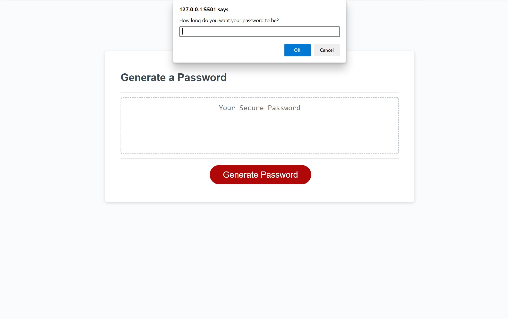

# Imrans-Accessible-Password-Generator

## Description

When I view the website I found a few bugs users reported. I got a ticket to go and find the issues within the Script files to make the website more useful for users. I solved the issues and make the website useful for the users. I used functions to solve the problem and make the website accessible for users and they can generate password in this webpage.

## Installation

At first when I receieved the starter code I used the git pull command from git bush to download the files that I needed to my computer. I was working on vs code to fix the issues and I frequently used git commits and pushes to github to get my repository up to date and make sure that my website is up to date. Below are the steps of installation:

1. Create a new repository on your GitHub account and clone it to your computer.
2. When you're ready to deploy, use the git add, git commit, and git push commands to save and push your code to your GitHub repository.

## Usage

This website is to build a password by using the symbols, numbers, and letters. You can open the website and use it to see how to generate password.
https://imran7rassi.github.io/Imrans-Accessible-Password-Generator/

## Credits

The websites thst I used to refernce:
1. https://www.w3schools.com/
2. https://developer.mozilla.org/
3. https://youtube.com/

## License

MIT License

Copyright (c) 2022 Imran rassi

Permission is hereby granted, free of charge, to any person obtaining a copy
of this software and associated documentation files (the "Software"), to deal
in the Software without restriction, including without limitation the rights
to use, copy, modify, merge, publish, distribute, sublicense, and/or sell
copies of the Software, and to permit persons to whom the Software is
furnished to do so, subject to the following conditions:

The above copyright notice and this permission notice shall be included in all
copies or substantial portions of the Software.

THE SOFTWARE IS PROVIDED "AS IS", WITHOUT WARRANTY OF ANY KIND, EXPRESS OR
IMPLIED, INCLUDING BUT NOT LIMITED TO THE WARRANTIES OF MERCHANTABILITY,
FITNESS FOR A PARTICULAR PURPOSE AND NONINFRINGEMENT. IN NO EVENT SHALL THE
AUTHORS OR COPYRIGHT HOLDERS BE LIABLE FOR ANY CLAIM, DAMAGES OR OTHER
LIABILITY, WHETHER IN AN ACTION OF CONTRACT, TORT OR OTHERWISE, ARISING FROM,
OUT OF OR IN CONNECTION WITH THE SOFTWARE OR THE USE OR OTHER DEALINGS IN THE
SOFTWARE.